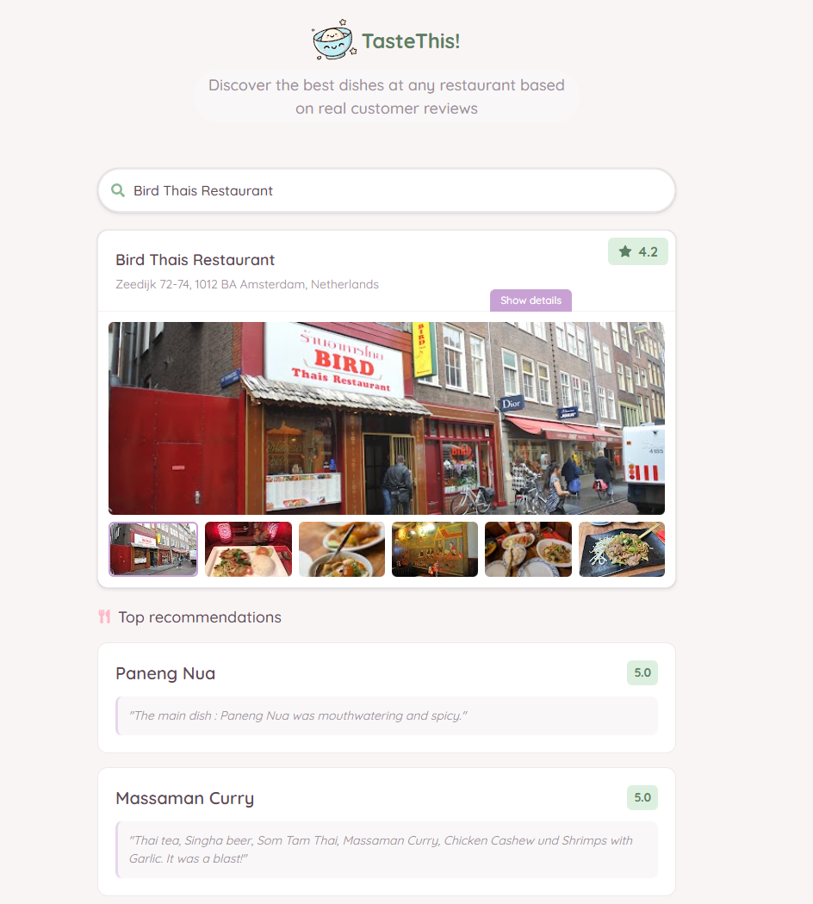

# Taste This

No more wondering what to order!

https://taste-this.com find the most popular dishes at restaurants. By analyzing customer reviews, we identify the most recommended dishes, their ratings, and what people are saying about them. 

#### Your guide to the most recommended dishes.

## Technology Stack and Features

- **Backend:**
    - [**Bun**](https://bun.sh) for the JavaScript/TypeScript runtime.
        - [Hono](https://hono.dev) for the web framework.
        - [Zod](https://zod.dev) for data validation.
        - [OpenAPI](https://www.openapis.org) for API documentation.
- **Frontend:**
    - [**React**](https://react.dev) with TypeScript, hooks, and Vite for a modern frontend stack.
        - [Chakra UI](https://chakra-ui.com) for UI components.
        - [TanStack Router](https://tanstack.com/router) for routing.
        - [TanStack Query](https://tanstack.com/query) for data fetching.
        - Generated client for consuming the backend API.
- **AI Integration:**
    - [Google Generative AI](https://ai.google.dev) integration.

## Preview

<p align="center">
  
</p>

## Project Structure
```
.
├── backend/
│   ├── src/
│   │   ├── api/         # API endpoints
│   │   ├── core/        # Core configurations
│   │   ├── scraper/     # Data scraping functionality
│   │   ├── utils/       # Utility functions
│   │   └── main.js      # Application entry point
└── frontend/
    ├── src/
    │   ├── assets/      # Static assets
    │   ├── client/      # Generated API client
    │   ├── components/  # Reusable UI components
    │   ├── config/      # Configuration files
    │   ├── routes/      # Application routes
    │   ├── services/    # Service layer
    │   └── types/       # TypeScript type definitions
    └── public/          # Static assets
```

## Setup Instructions

### Backend Setup

1. Set up environment variables in `backend/.env` (you can copy from `.env.example`):

2. Navigate to the backend directory:
```bash
cd backend
```

3. Install dependencies:
```bash
bun install
```

4. Start the development server:
```bash
bun dev
```

The backend server will be available at the configured port.

### Frontend Setup

1. Navigate to the backend directory:
```bash
cd frontend
```

2. Install dependencies:
```bash
pnpm install
```

3. Set up environment variables:
   - Copy `.env.example` to `.env.local`
   - Update the variables as needed

4. Start the development server:
```bash
pnpm run dev
```

5. The application will be available at `http://localhost:5173`

## Contributing
1. Fork the repository
2. Create a new branch for your feature
3. Commit your changes
4. Push to your branch
5. Create a Pull Request

## Acknowledgements
- [YasogaN/google-maps-review-scrape](https://github.com/YasogaN/google-maps-review-scrape) - Used as scraper implementation in this project.

